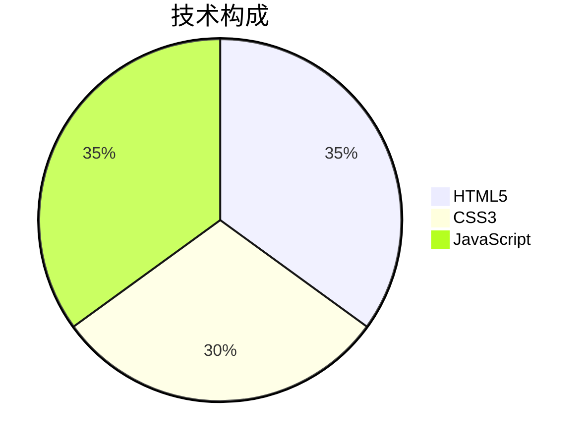

#  ToDoList

<div style="border-left: 4px solid #FF9A76; padding-left: 15px; margin: 20px 0;">
一款融合任务管理与音乐播放的治愈系平台，专为高效生活设计。
</div>

## ✨ 核心功能
✅ **任务管理**  
✔️ 添加/完成/删除任务  
✔️ 本地自动保存  
✔️ 完成进度统计  

🎵 **音乐陪伴**  
✔️ 网易云音乐集成  
✔️ 专注模式白噪音  

## 🖥️ 界面预览
  
（将图片拖到docs文件夹内，替换EXAMPLE为你的图片名）

## 🛠️ 技术栈


## 📦 安装使用
1. 克隆仓库：
   ```bash
   git clone https://github.com/你的用户名/仓库名.git
   ```
2. 直接打开 `index.html`

[➡️ 立即体验](https://你的用户名.github.io/仓库名/) 